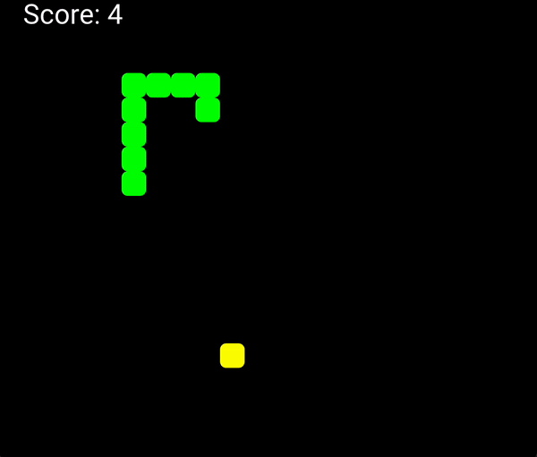

# Upgrading Scenic 0.10 to 0.11

[Scenic](link.to.scenic) is a framework that allows for creation of graphical user interface applications in Elixir. It is also compatible with [Nerves](link.to.nerves).

Just a few weeks ago the creator of Scenic released version 0.11.0 and says it is really starting to feel like a 1.0 release. [Here is a link to Boyd Multerer's announcement](https://youtu.be/F_A3xxLxWrQ)

This release contains an [upgrade guide for applications running on v.0.10](https://hexdocs.pm/scenic/upgrading_to_v0-11.html). 

Since we recently built a Snake game during Noggin Day, following a tutorial by [Giancarlo França](https://medium.com/@giandr/elixir-scenic-snake-game-b8616b1d7ee0) we decided that this would be a good project to test drive the upgrade docs.


## Key takeaways
The upgrade documentation is helpful and following the step by step directions we were able get most of the way through the upgrade with just a few hurdles. Here are our key takeaways from the upgrade process.

1. `Scenic.Driver.Local` is the new driver

    This replaces `Scenic.Driver.Glfw`
1. Scenes now have assigns similar to `LiveView` and `Plug.Conn`.

    This is a really nice change that allows you to write [CRC style pipelines](https://redrapids.medium.com/learning-elixir-its-all-reduce-204d05f52ee7) similar to how would write them in other common Elixir frameworks using `assign/2`.
    In v0.11.x y
    ```elixir
    new_scene = assign(scene, key: :value)
    {:ok, new_scene}
    ```
    
    Prior to v0.11.0 you needed to manage scene state and graph separately 
    ```elixir
    state = %{
      viewport: viewport,
      key: value,
      graph: graph
      }
    graph = draw_change(graph, change)
    {:ok, state, graph}
    ```
    

1. `push_graph/2` is no longer deprecated and is now the preferred api for updating a graph.

    ``` 
    graph =
      @graph
      |> draw_changes(graph, changes)      
	push_graph(scene, graph)
    ```
1. Inputs must be now be requested explicitly using `request_input/2` or `capture_input/2`
    ```elixir
    request_input(scene, request_input(scene, [:key, :cursor_position])
    ```
    
    - This one was not clear in the upgrade docs but we were able to reach out to the Scenic community via the  `#scenic` channel in the elixir Slack.

If you need assistance upgrading your existing scenic codebase to utilize the new 0.11.x+ updates consider [working with us](https://binarynoggin.com/contact-us/) to ease your effort!



Additional resources: [Upgrade Branch in Snake Application](https://github.com/BinaryNoggin/scenic-snake/tree/upgrade-10-to-11)